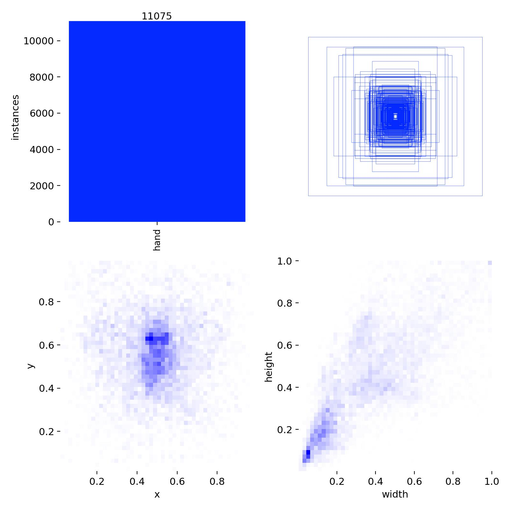
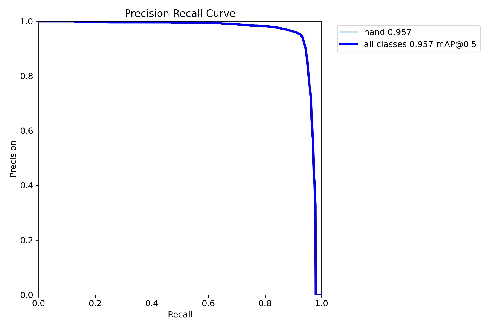
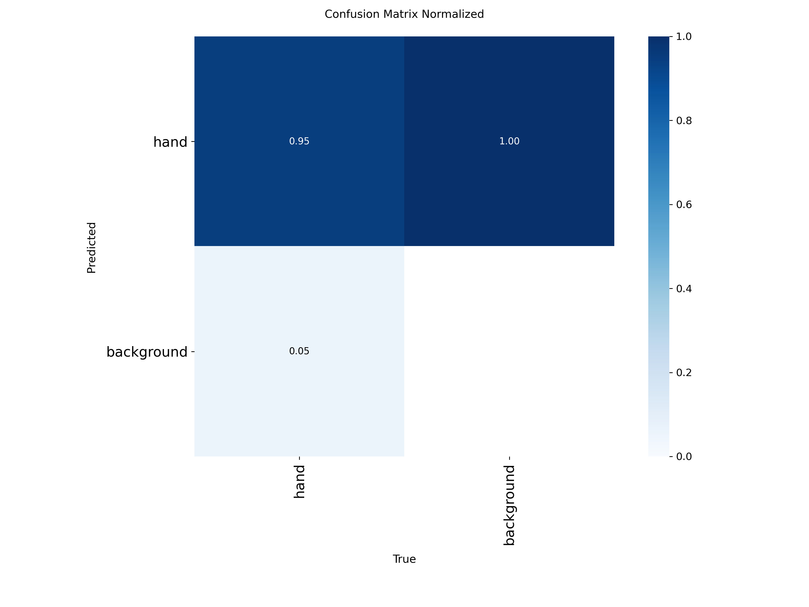
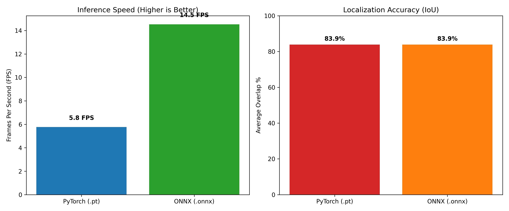
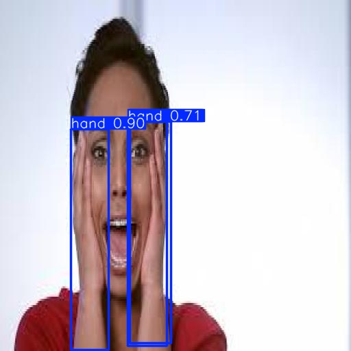
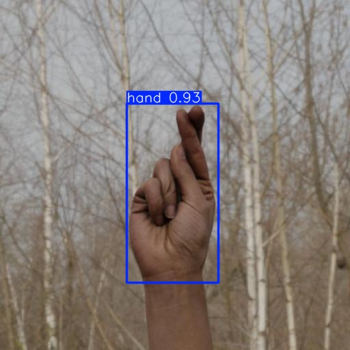
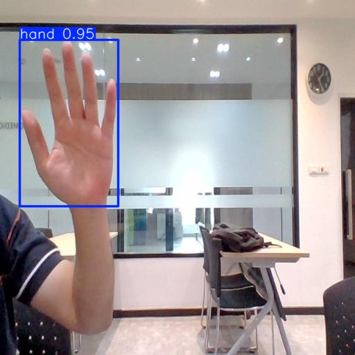

# Touchless HCI: Real-Time Hand Tracking using YOLO

## 🎯 Project Overview
This project implements a robust, real-time hand-tracking pipeline designed as the foundational computer vision layer for a Touchless Human-Computer Interaction (HCI) mouse system. The objective is to accurately detect and track human hands in varying environments, lighting conditions, and complex gestures (such as closed fists and pointing) using consumer-grade edge hardware.

By implementing advanced dataset engineering, cloud-based GPU training, and local ONNX graph fusion, this system achieves a high-precision, low-latency deployment capable of running on standard CPUs without dropping frames.

---

## 🛠️ Dataset Engineering & Preprocessing
A major engineering hurdle in this project involved unifying complex, multi-class gesture datasets into a single, cohesive tracking target.

* **Dataset Scale:** The model was trained on a massive, curated dataset of **12,000 images** to ensure generalization across different environments and prevent "pose bias" (where models fail to recognize side profiles or closed fists).
* **The 73-to-1 Class Bypass:** During the merging of American Sign Language (ASL) datasets, the web-based preprocessing tools failed to bind 73 distinct text labels to a single target, resulting in implicit pass-through errors. This was solved programmatically via a custom Python data-wrangling script that iterated through thousands of raw `.txt` annotation files on the cloud server, forcibly overriding all classes to a unified `0: hand` class.

**Dataset Distribution:**

*(Visualizing the normalized bounding box dimensions and spatial distribution across the 12,000-image dataset)*

---

## 🧠 Model Training (Cloud Infrastructure)
The model was trained iteratively across multiple versions using an **NVIDIA Tesla T4 GPU** to handle the heavy mathematical matrix multiplications required for 12,000 images.

* **Architecture:** YOLO (v8/v11 architecture)
* **Hyperparameter Optimization:** `batch=32` was utilized to perfectly saturate the 15GB VRAM of the T4 GPU.
* **Overfitting Prevention:** An early stopping mechanism (`patience=15`) was implemented to mathematically guarantee the best weights were saved without memorizing the training data.
* **Training Metrics:** The model successfully converged at 100 epochs, achieving a **95.7% mAP50** and **95.1% Precision**.

**Training Convergence & Loss:**


**Model Precision-Recall & Confusion Matrix:**
<p align="center">
  
  
</p>

---

## ⚡ Edge Hardware Optimization (Local Deployment)
To transition the model from a cloud GPU to local CPU edge hardware (AMD Ryzen 7 PRO 3700U), the PyTorch weights (`best.pt`) were exported to the **ONNX (Open Neural Network Exchange)** format.

This optimization performed mathematical Graph Fusion, stripping out the heavy Python training dependencies and compiling the neural network into static machine code optimized for `onnxruntime` execution.

### 📊 Local Benchmark Report (Unseen Test Data)
A strict, head-to-head A/B test was conducted across **1,264 unseen test images** (containing 1,544 human-labeled ground truths) to verify the optimization impact on local hardware:

| Metric | PyTorch (`best.pt`) | ONNX (`best.onnx`) |
| :--- | :--- | :--- |
| **Accuracy (Avg IoU)** | 83.9% | **83.9% (Identical)** |
| **Average Latency** | 173.4 ms/image | **68.8 ms/image** |
| **Throughput / Speed** | 5.8 FPS | **14.5 FPS** |

**Result:** The ONNX optimization delivered a **2.52x speedup** on standard CPU hardware, making real-time touchless mouse tracking viable without sacrificing any localization accuracy.

**Hardware Performance Dashboard:**


### ✋ Visual Detection Example
Even in challenging poses (hands occluding the face), the optimized model retains high confidence tracking capabilities on unseen data:






---

## 🌐 FastAPI Backend Deployment
To prove the model's viability as a decoupled software product, the inference engine is wrapped in a high-performance **FastAPI** server. This allows external devices and applications to interact with the tracking system over the internet.

### Endpoints
* `GET /webcam`: **[NEW]** A live, low-latency streaming endpoint that hooks into the server's webcam, processes frames through the ONNX model, and streams the annotated video feed directly to your web browser.
* `POST /predict/`: A machine-readable endpoint that receives an image and returns the exact spatial coordinates (x1, y1, x2, y2) and confidence scores in a lightweight **JSON** format.
* `POST /predict_and_draw/`: A visual debugging endpoint that receives an image, processes the YOLO math, and streams back a JPEG image with the bounding boxes physically drawn via OpenCV.

---

## 🚀 Quick Start Guide

### 1. Installation
Clone the repository and install the dependencies:
```bash
git clone [https://github.com/YourUsername/Touchless-HCI-Hand-Tracker.git](https://github.com/YourUsername/Touchless-HCI-Hand-Tracker.git)
cd Touchless-HCI-Hand-Tracker
pip install -r requirements.txt

*(Ensure `onnx`, `onnxruntime`, `fastapi`, `uvicorn`, `python-multipart`, and `ultralytics` are installed).*

### 2. Run the Live API Server
Launch the FastAPI backend locally:
```bash
uvicorn api:app --reload

### 3. Access the Interface
Open your browser and navigate to:
`http://127.0.0.1:8000/docs`

From the Swagger UI, you can directly upload test images to the `/predict_and_draw/` endpoint to test specific frames, or hit the `/webcam` endpoint in your browser to see the live real-time hand tracking in action.

*(Note: For external access across devices, tunnel the local port using `ngrok http 8000`).*

---

## 👥 Project Team
* Ahmed Khalid
* Omar A. El Nasser
* Bassel Adel
* Karim Hossam
* Mohamed Haitham
* Omar Bekhiet